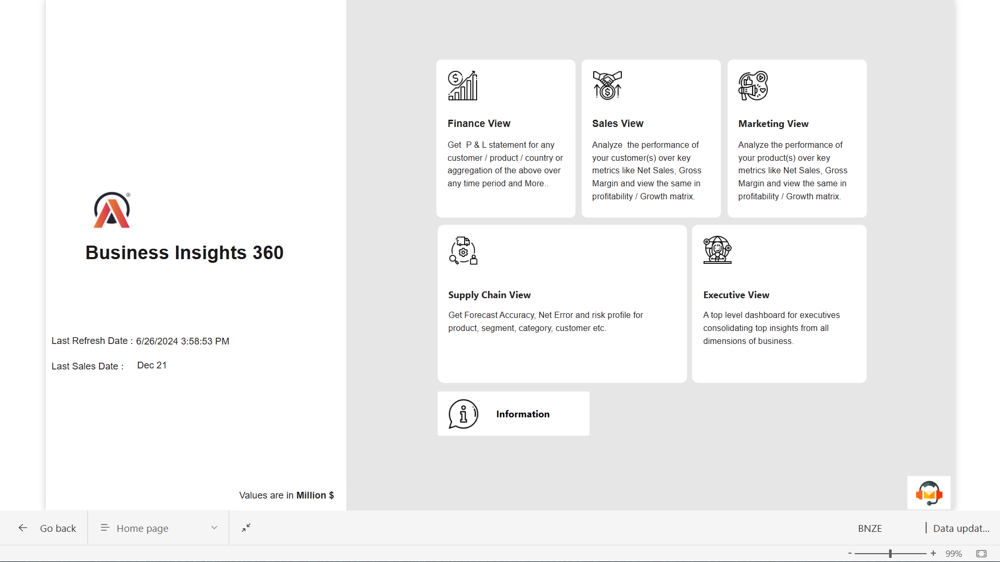

## PowerBI-project---Business-Insights-360

**End to end Power BI project**

- I am excited to share my learnings in Power BI project from codebasics. During this journey, I have learnt many new concepts and enjoyed a lot while working on this project. To start with, Power BI is excel on steroids. It is easier and faster to build dashboards in Power BI than in excel when dealing with large data.

**Project Overview**

AtliQ Hardware, a leading global manufacturer, embarked on a journey to harness data-driven insights crucial for informed decision-making across various business domains. They were facing challenges in finding the insights from the data so we were given the task to create reports and dashboards and find the insights from the data they provided to us.

**Tech Stacks**

➡ Power BI

➡ Power Query Editor

➡ DAX Language

➡ DAX Studio (for report optimization)

➡ Project Management tools

**Domain knowledge:**

-	Data analytics, data warehouse, data catalog, OLTP, OLAP 
-	Star schema, snowflake schema
-	FY- Fiscal Year
-	YTD - Year to date
-	 YTG - Year to go
-	Gross sales
-	Pre invoice deductions
-	Net invoice sales
-	Post invoice deductions
-	Net sales
-	Manufacturing costs, freight costs
-	COGS- Cost of goods sales
-	Gross margin, gross margin percentage
-	Gross margin per unit
-	Net profit, net profit percentage
-	Sales quantity, forecast quantity
-	Net error, absolute error, forecast accuracy

**Functions used :**

CALCULATE, ALLNOBLANKROW, RELATEDTABLE, SAMEPERIODLASTYEAR, SWITCH, HASONEVALUE, ISCROSSFILTERED, IF, DIVIDE, etc

**Visualization**

Cards & KPIs, Table & Matrix, filtering, Bookmark, Button, Tooltip, Drill Through, tools like Conditional formatting and Top N slicers, and report navigation helped to add interactivity. Charts used - Donut, Scatter, Area, Ribbon, Waterfall, Line and clustered Column.

**Other links**

📊 **Live Dashboard Interaction**: – [https://lnkd.in/dwyq6u7e](https://app.powerbi.com/view?r=eyJrIjoiNGM2Y2VlNTgtMjZmNC00NTg4LTgyMDMtMjY1NjJhYzAwZjYyIiwidCI6ImM2ZTU0OWIzLTVmNDUtNDAzMi1hYWU5LWQ0MjQ0ZGM1YjJjNCJ9)

📽️ **Linkedin Presentation:** - [https://lnkd.in/dnaVeQwn](https://www.linkedin.com/posts/naveen-kumar-n-095051195_hello-guyz-i-am-happy-to-share-my-latest-activity-7229181779243417601-rzET?utm_source=share&utm_medium=member_desktop)

